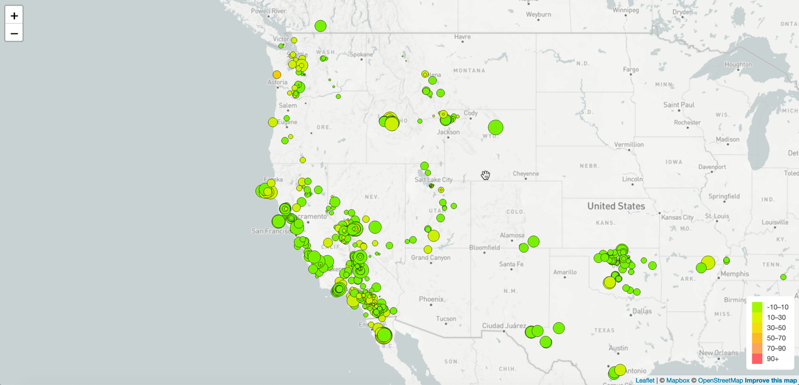

# Leaflet_Challenge

Welcome to the United States Geological Survey, or USGS for short. The USGS is responsible for providing scientific data about natural hazards, the health of our ecosystems and environment; and the impacts of climate and land-use change. Their scientists develop new methods and tools to supply timely, relevant, and useful information about the Earth and its processes. As a new hire, you will be helping them out with an exciting new project!

The USGS is interested in building a new set of tools that will allow them to visualize their earthquake data. They collect a massive amount of data from all over the world each day, but they lack a meaningful way of displaying it. Their hope is that being able to visualize their data will allow them to better educate the public and other government organizations (and hopefully secure more funding) on issues facing our planet.

## Your Task

### Level 1: Basic Visualization
   
    
1. **The Data Set**

   

   The USGS provides earthquake data in a number of different formats, updated every 5 minutes. Visit the [USGS GeoJSON Feed](http://earthquake.usgs.gov/earthquakes/feed/v1.0/geojson.php) page and pick a data set to visualize. This project uses the "All Earthquakes for the Past 7 Days.

   

2. **Import & Visualize the Data**

    

   The map above was created using Leaflet and plots all of the earthquakes from the selected data set based on their longitude and latitude.

   * Data markers reflect the magnitude of the earthquake by their size and and depth of the earthquake by color. Earthquakes with higher magnitudes appear larger and earthquakes with greater depth appear darker in color.

   * Popups provide additional information about the earthquake when a marker is clicked including the place, time, magnitude and depth. 

- - -

### Level 2: More Data (Optional)

The USGS requested a second plot of a second data set on the map to illustrate the relationship between tectonic plates and seismic activity. Data on tectonic plates was found at <https://github.com/fraxen/tectonicplates>.

- - -
### Future & Issues
* Would like to add in the alert level showing estimated fatalaties and losses in dollars. Alert levels are color coded and so were depths. 
* Should markers appear on all layers and should they be functional on all layers?

